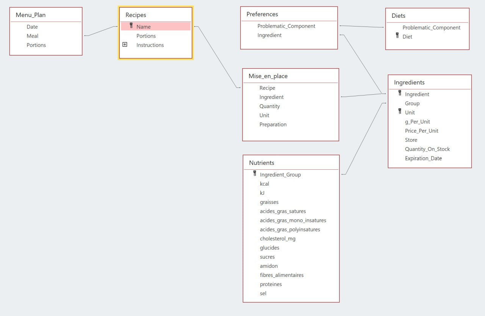
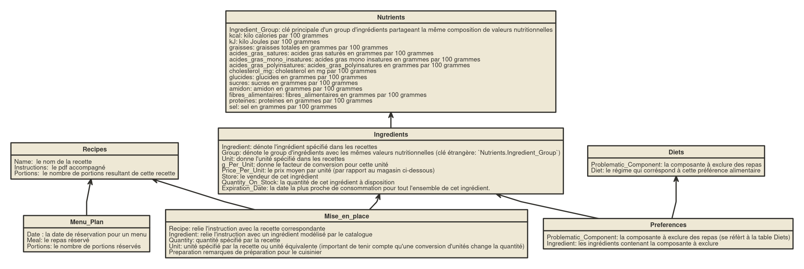

****---
title: "CookBook Documentation" 
author: "Ismael Shabazz Issaka"
date: "`r Sys.Date()`"
header-includes:
    - \usepackage{listings}
    - \usepackage{verbatim}
    - \usepackage{mathtools}
    - \usepackage{mathpartir}
output:
   pdf_document:
      toc: true
      fig_caption: true
      number_sections: true
---


# Description générale 

## Motivation

L'approche de `CookBook` est de donner des outils pour organiser et automatiser des tâches fréquemment rencontrés dans le contexte de gestion culinaire à long terme, 
soit dans la cuisine d'un ménage privé, soit dans la cuisine d'un réstaurant, soit dans la prise de commande d'un vendeur en ligne.
L'interêt pour l'utilisateur est de pouvoir réserver des repas en tenant compte des matériels à disposition, des coûts associés et la liste des achats.
Les outils principales permettend de choisir des repas, soit en fonction de préférences alimentaires, soit en fonction d'ingrédients proche de leur date de consommation.

## Domaine d’application

Le système `CookBook` est conçu pour gérer un plan de menus en fonction d'un catalogue de recettes et ingrédients présentes dans la base de données 
pour la préparation de repas (`Meals`), la géstion de provisions (`On_Stock`) et la coordination d'aquisitions pour un plan de menus (`Menu_Plan`) à long terme.
Les données compris dans les tables modélisent les ensembles de recettes (**Recipes**), d'ingrédients (**Ingredients**), les infos sur les valeur nutritionnelles (**Nutrients**), 
les instructions pour la préparation (**Mise_en_place**), des tables pour réserver des repas (**Menu_Plan**) et pour spécifier des préférences alimentaires (**Diets**, **Preferences**).
Les applications de ce système sont 
- Consultation des informations 
	- sur les repas et les ingrédients(composition d'ingrédients, disponibilité des ingrédients instructions, valeurs nutritionnelles, prix,préférences alimentaires)
	- sur le plan de menus (consommation, dépenses et prix par rapport à des intervalles de temps)
	- sur les achats nécessaires pour réaliser le plan de menus
	- Indication des ingrédients proche de leur date de consommation (qui ne sont pas encore réservés pour le plan de menus)
- Selection de repas pour le plan de menus
	- en fonction de préférences alimentaires
	- en fonction d'ingrédients proche de leur date de consommation
- Mise à jour du système
	- Modification des quantités d'ingrédients et date de consommation se fait manuellement sur les tables contenant les données
	- Ajout de recettes, ingrédients, préférences etc dans le catalogue se fait manuellement sur les tables contenant les données

  
##  Use Cases

### Besoins utilisateurs

Les utilisateurs potentiels de ce système pourront être 
- **Individus**: des individus qui aimeraient bien introduire une systématique dans leurs habitudes de cuisiner, dans le context d'un ménage privé
- **Client**: des consommateurs d'un service gastronomique 
- **Entreprise**: des entreprises gastronomiques qui ont besoin d'un système pour coordonner leurs services à l'intérieure
- **Service Web**: des plateformes comme `eat.ch` pour gérer les commandes et communiquer les besoins entre producteur et consommateur ou des cantines qui veulent afficher le plan de menus sur leur site web


#### Use cases: acteurs et interactions

- Producteur (Cuisinier)
	- Consultation des instructions pour les repas d'une jounrée spécifique avec `F_Instructions` 
	- Mise à jour des quantités d'ingrédients  (`On_Stock`) et des dates de consommation (`Expiration_Date`)
- Entreprise (Responsable approvisionnement ) 
	- Mise à jour des quantités d'ingrédients  (`On_Stock`) et des dates de consommation (`Expiration_Date`)
	- Consultation de la liste d'achats (`Aquisitions`,`Aquisition_Units`)
	- Calcul Budget pour un plan de menus (`F_Budget`)
- Vendeur (Plateformecomme _eats.ch_, Restaurant)
	- Affichage des prix (`V_Meal_Price_Per_Portion`)
	- Affichage des repas dont les ingredients sont à disposition (`V_Meal_Availability`)
	- Suggerer des repas qui utilisent des ingrédients proche de leur date de consommation  (`F_Meal_Suggestion`)
	- Suggerer des repas en fonction de préférences (`F_Meal_Preferences`)
- Consommateur publique (Client) 
	- Consulter le plan de menus (`V_Menu_Plan_Details`, `F_Menu_Plan_Day`)
	- Consulter le résumé des infos de tous les repas (`V_Meal_Statistics`)
	- Selectionner des repas (`F_Meal_Preferences`, `F_Meal_Suggestion`)
- Consommateur privé (Individu)
	- Calculate Budget for a given interval of time (`F_Budget`) 
	-  Calculate Nutritional Consumption for a given interval of time (`F_Diet`)
	-  Display Instructions for the meals of that date (`F_Instructions`)

\newpage

# Conception des tables

## Schémas des relations  



##  Diagramme des classes 



\newpage


### Tables: Catalogue

- **Recipes**

	La  table des recettes `Recipes` gère le catalogue de pdfs agissant comme source des instructions pour la préparation
 - **Mise_en_place**
 
	La table mise en place `Mise_en_place` contient les instructions de préparation en détail 
 - **Ingredients**
 
	La table des ingrédients `Ingredients` gère le catalogue des ingrédients et leur état de disponibilité.
	
	> **Remarque**: `g_Per_Unit`
	>
	> Le facteur de conversion ne dépende pas seulement de l'unité, mais il dépend de l'ingrédient et de l'unité parce que desfois 
	>	l'unité est donné en volume, et une cuillère de fromage râpé ne pèse pas forcement autant qu'une cuillère de sel; Par conséquent,
	>	il n'y a pas de dépendance transitive parmi les attributs non-clés dans cette table
	>
	> **Exemple**: `Expiration_Date`
	>
	>  Si on a deux bananes avec delais differentes, on choisit la date de consommation la plus proche et lorsqu'on consomme cette banane on met à jour la date pour indiquer celle de la deuxième banane
	
- **Nutrients**

	La table des valeurs nutritionnelles `Nutrients` regroupe les `Ingredients` avec le même champs `Group` de la table `Ingredients`  par rapport à leur composition.

### Tables: Plan de menus

- **Diets**

	La table des régimes `Diets` permet de saizir des préférences alimentaires dont le système doit tenir compte
	
 - **Preferences**
 
	La table des préférences identifie les ingrédients contenant les composantes problématiqhes à exclure .
	
 - **Menu_Plan**
 
	Le plan de menus permet de deposer des réservations de repas présentes dans le catalogue.


\newpage

# Troisième forme normale

- **Premiere Forme Normale**
      Tous les attributs figurants dans les tables de la de base de données respectent le premier critère d’**atomicité**,
      c’est-à-dire que toutes les valeurs contenues dans chacune des tables sont indivisibles (atomiques). Pour renforcer ce principe, 
      on pourrait encore eliminer des rédondances au niveau du langage utilisé dans les recettes, ce qui réduirait le nombre d'occurrences 
      d'un même couple ingrédient et unité, mais ceci n'est pas directement lié à la conception des relations mais plutôt au fait qu'on n'a pas 
      des sources homogènes par rapport à cet aspect. 
- **Deuxième Forme Normale**
	  Tous les attributs de tables qui ont une clé primaire sont en dépendence fontionnelle totale de la clé primaire. A noter que dans`Ingredients`, la clé composé (`Ingredient`, `Unit`) 
	  détermine toutes les autres attributs comme le facteur de conversion et le prix (dépendent de l'unité) etc, le seul attribut qui n'est pas directement attribut de la clé primaire 
	  est peut-être la date de consommation `Expiration_Date`. Si on trouve une meilleure façon de gérer les synonymes et un méchanisme pour généraliser les quantités à disposition et 
	  les facteurs conversions, par exemple un champs comme `Groupe` qui sert pour généraliser les valeurs nutritionnelles, on pourait de la même façon éliminer des redondances de cette sorte, 
	  mais il faudrait trouver un bon standart homogène qui permet de faire ce regroupement sans introduire des incohérences au niveau des valeurs  fonctionnelles (p.ex si on regroupe des 
	  choses qui ne sont pas entièrement uniforme par rapport à un aspect).  
 - **Troisieme Forme Normale**
		Originalement, la table des ingrédients comprenait aussi les infos nutritionnelles, mais avec le regroupement, beaucoup de données redondantes se sont éliminés, 
		puisque plusieurs ingrédients partagent la même composition de valeurs nutritionnelles (ou au moins aussi négligeable que ce ne ferait pas de différence pour l'utilisation personnelle).
		 De même pour `Diets`, originalement la table contenait 3 colonnes (`Problematic Component`, `Diet`, `Ingredient`), mais comme on peut déterminer les composantes problématiques 
		 en fonction du régime, et les ingrédients en fonction de la composante problématique, il convient d'éliminer la dépendence transitive et introduire une nouvelle table. 
        Comme il n'y a plus de dépendance fonctionnelle entre les attributs d'une relation, les tables sont en troisième forme normale. 
      
- **Remarque: Decomposition**
	La table `Diets` ne réspecte pas strictement le principe d'atomicité, mais comme les composantes problématiques 
      ne font pas partie des objets principales de ce système et qu'il n y a pas d'autres éléments qui dépendent dessus fonctionellement, 
      il est inutile de diviser l'enregistrement `Meat and Fish` en `Meat`, `Fish` pour le cas de `Vegetarian diet`, idem pour le régime vegan. 
      On considère cet attribut une valeur catégorique puisqu'on ne distingue pas les differentes occurence de cette catégorie hors de l'identification des ingrédients correspondantes. 
      Ainsi, si on pose `Diet` comme clé primaire, et la catégorie de composante problématique qu'elle détermine est en dépendance fonctionelle totale avec la clé et donc en troisième forme normale.
   Les seules relations qui ne sont pas en troisième forme normale sont le plan de menus `Menu_Plan`, ici on peut faire autant de doublon qu'on veut sans casser l'intégrité du système et les tables 
    `Mise_en_place` et `Preferences`, ou il suffit de prendre comme clé primaire composé l'ensemble des attributs qui doivent être unique et l'intégrité du système est réspecté.


\newpage 

# Requêtes d’interrogation


**Remarque**:

La convention de nommage suivante est utilisé pour dénoter les requêtes:

- `F_Formulaire`, les requêtes contenant des paramètres de formulaire MSAccess sont préfixés par 'F'
- `V_Vue`, les requêtes contenant des vues intermédiaires sont préfixés par 'V'

## Consultation
Pour voir des infos globales sur les menus dans `CookBook`:

- `V_Meal_Statistics` : Affiche un résumé de chaque repas, incluant le prix standard, nombre d'ingrédients nécessaire, nombre d'ingrédients manquantes, prix d'une portion (sans tenir compte des produits disponibles dans `On_Stock`), coût d'une portion  (en tenant compte des produits disponibles dans `On_Stock`, mais sans tenir compte de ce qui est utilisé pour le plan de menus ) , les infos nutritionnelles et un résumé des composantes problématiques.

Pour préparer des repas, le système fournit des moyens pour intérroger:

- `Mise_en_place`: la composition et préparation de menus
- `V_Meal_Availability`: les repas pour lesquelles toutes les ingrédients sont à disposition
- `V_Meal_Nutrients_Per_Portion` et `V_Ingredients_Nutrients`: les infos nutritionelles  associées à un repas ou un ingrédient
- `V_Meal_PC_Summary` et `V_Meal_Problematic_Components`: les infos sur composantes problématiques par rapport aux préférences spécifiées
- `V_Meal_Price_Per_Portion`: les prix associés aux repas par portion
- `V_Meal_Statistics`: liste un résumé des infos ci-dessus pour chaque recette

Pour coordonner les aquisitions, le système permet d'interroger 

- `V_Aquisitions` et `V_Aquisitions_Units`: liste d'achats pour le plan de menus
- `V_Menu_Plan_Ingredients_Count`: la disponibilité et utilisation d'ingrédients, les quantités utilités dans le plan de menus et les quantités manquantes pour réaliser le plan de menus
- `V_Menu_Plan_Expiring_Next`:  les delais de consommation et les quantités restants après réalisation du plan de menus

Le plan des menus permet de consulter les informations des repas dans le plan de menus de plusieures façons: 

- `V_Menu_Plan_Details`: Affiche les dates, les repas et les informations associés (prix, infos nutritionnelles, composantes problématiques etc)
- `V_Menu_Plan_Price_Overview`: Affiche le prix par date sans indication de repas ou portions
- `V_Menu_Plan_Price_Total`: Calcule le prix total pour réaliser le plan (sans tenir compte des produits disponibles dans `On_Stock` )
- `V_Menu_Plan_Cost_Total`: Calcul du coûts totale pour le plan de menus, incluant seulement les quantités manquantes dans la somme.

Pour interroger l'utilisation d'ingrédients par rapport au plan de menus, le système permet d'afficher:

- `V_Menu_Plan_Ingredients_Count`: Calcule le nombre et la quantité d'ingrédients réservés pour le plan de menus, ainsi que les quantités manquantes
- `V_Menu_Plan_Expiring_Next`: Liste les ingrédients qu'il faut utiliser bientôt parce qu'ils ne sont pas encore utilisés pour le plan de menus avant la date de consommation

\pagebreak 

## Selection

Pour modifier le plan de menus, le système permet de séléctionner des repas en fonction de:

- `F_Preferences`: les préférences spécifiés dans un formulaire
- `F_Expiring`: suggestion en fonction de date de consommation des ingrédients

Pour selectionner des informations,  le système permet de spécifier:

- `F_Instructions_Date` Display Instructions for the meals of that date
- `F_Instructions_Recipe` Display Instructions for a meal specified by a recipe
- `F_Meal_Problematic_Components`: list of problematic components for a specified meal
- `F_Meal_Statistics` : Overview over a selected meal
- `F_Menu_Plan_Budget` Calculate Cumulative budget for a given interval of time
- `F_Menu_Plan_Budget_Details` Calculate detailed budget for a given interval of time, grouped by `Date`
- `F_Menu_Plan_Consumption` Calculate Nutritional Consumption for a given interval of time
- `F_Menu_Plan_Cost_Partial` Calculate effective costs for a given interval of time
- `F_Menu_Plan_Details`: Shows the detailed menu plan for a selected interval of time
- `F_Menu_Plan_Ingredients_Count`: Shows the detailed quantities of ingredients used and missing with respect to the menu plan


\newpage


# MSAccess Forms

## Catalog Details
- Consultation en fonction de date
	- `Instructions by date`: consultez cette vue pour obtenir les instructions de recette et mise en place pour les menus de cette date.
	- `Reservations by date`: consultez cette  vue pour obtenir des informations du plan de menus pour cette date. 
- Consultation en fonction de Recette
	- `Instructions by recipe` : consultez cette  vue pour obtenir les instructions de recette et mise en place en fonction du nom de la recette.
	- `General infos by recipe`: consultez cette vue pour obtenir le résumé d'infos générales sur la recette en question.
	- `General infos by recipe`: consultez cette vue pour afficher les ingrédients potentiellement problématiques contenues dans la recette en question.

## Budget and Consumption

- Permet de selectionner un intervalle de temps et afficher les informations suivantes par rapport à cet interval:
	- `Partial cost for specified interval ` : Le coût partiel du plan de menu dans cet intervalle (coût effective tenant compte des ingrédients à disposition)
	- `Cumulative budget for specified interval ` : Le budget nécessaire pour réaliser le plan de menus sans considerer les ingrédients sur place
	- `Detailed budget for specified interval ` : Le budget nécessaire pour réaliser le plan de menus sans considerer les ingrédients sur place pour chaque jour dans l'intervalle
	- `Detailed nutrient consumption for specified interval ` : Les valeurs nutritionnelles associées à chaque jour de cet intervalle

## Meal Selection
- **OPTION 1: **  Meal preference specification: 
	- `Preferences`: choix de repas en fonction de la preference alimentaire indiqué.
- **OPTION2: ** Meal selection by Expiration Date: 
	- `Expiring`: choix de repas en fonction d'un d'intervalle de consideration délimitant les dates de consommation des ingrédients à utiliser.
	  Les ingrédients considérés ne sont pas encore réservés pour le plan de menus et vont pourrir pendant cet interval . 


\newpage

# Conclusions 


Le système `CookBook` donne des outils pratiques à un utilisateur  pour systématiser le planning des repas, mais pour un cadre industrielle, il faudrat probablement changer de plateforme: 
au lieu de MSAccess avec des tables Excel, un service qui peut gérér plus de modifications et automatiser la saizie de recettes et d'instructions, 
ainsi l'automatisation des transactions sur le matériel à disposition et les dépenses associées pourront être géré par une application qui coordonne les differentes parties d'une entreprise gastronomique, 
p.ex. on pourrait protocoller la réalisation effective de repas et en déduire directement les nouvelles quantités en stock etc.

La partie la plus délicate de ce système est la qualité des valeurs utilisés dans les tables `Ingredients` et `Nutirents`, parce que tous les calculs sont plutôt sensible 
par rapport à des incohérences numériques liées à des facteurs de conversion qui peuvent être variables en fonction d'unité et ingrédient utilisé, et ils entrainent 
des effets sur le calcul des valeurs nutritionnelles et les calculs du prix. Pour cela, on conseille à l'utilisateur de considérér les valeurs calculés comme des approximations indicatives, pas des calcules exactes.
Pour augmenter la précision des calculs, il est recommendé de prendre les mesures pour les conversions d'unités lors de mise en emploi du système, avec les prix effectivement utilisés pour les ingrédients etc.

Ce système ne donne pas de garantie sur la véracité des informations utilisés, ni les informations calculés, et il est recommendé de fournir les valeurs individuellement.
Les exemples utilisés dans ce projet sont inspiré par des vraies données mais servent à des fins illustratives uniquement.


\newpage

# Annexe -  CookBook Version mysql


## Setup DB Tables


```sql
DROP DATABASE IF EXISTS CookBook;
 

CREATE DATABASE CookBook;
USE CookBook;

CREATE TABLE Diets (
	Problematic_Component VARCHAR(15) NOT NULL, 
	Diet VARCHAR(17) NOT NULL,
     PRIMARY KEY (Problematic_Component)
);

LOAD DATA LOCAL INFILE 
  './CSVTables/Diets.csv' 
INTO TABLE Diets 
FIELDS TERMINATED BY ','
IGNORE 1 LINES
(Problematic_Component, Diet) ;


CREATE TABLE `Ingredients` (
	`Ingredient` VARCHAR(30) NOT NULL, 
	`Group` VARCHAR(16) NOT NULL, 
	`Unit` VARCHAR(7) NOT NULL, 
	`g_Per_Unit` DECIMAL NOT NULL, 
	`Price_Per_Unit` DECIMAL(10,6) NOT NULL, 
	`Store` VARCHAR(14) NOT NULL, 
	`Quantity_On_Stock` DECIMAL NOT NULL, 
	`Expiration_Date` DATE NOT NULL, 
    PRIMARY KEY (`Ingredient`, `Unit` )   
);

LOAD DATA LOCAL INFILE 
  './CSVTables/Ingredients.csv' 
INTO TABLE Ingredients 
FIELDS TERMINATED BY ','
IGNORE 1 LINES
( 	`Ingredient`,`Group`, 
	`Unit`,
	`g_Per_Unit`,
	`Price_Per_Unit`,
	`Store`,
	`Quantity_On_Stock`,
	`Expiration_Date`
) ;


```

\newpage

```sql

CREATE TABLE `Menu_Plan` (
	`Date` DATE NOT NULL, 
	`Meal` VARCHAR(32) NOT NULL, 
	`Portions` DECIMAL NOT NULL
);

LOAD DATA LOCAL INFILE 
  './CSVTables/Menu_Plan.csv' 
INTO TABLE `Menu_Plan` 
FIELDS TERMINATED BY ','
IGNORE 1 LINES
(`Date`,`Meal`,`Portions`) ;

CREATE TABLE `Mise_en_place` (
	`Recipe` VARCHAR(39) NOT NULL, 
	`Ingredient` VARCHAR(30) NOT NULL, 
	`Quantity` DECIMAL(10,2) NOT NULL, 
	`Unit` VARCHAR(7) NOT NULL, 
	`Preparation` VARCHAR(68)
);

LOAD DATA LOCAL INFILE 
  './CSVTables/Mise_en_place.csv' 
INTO TABLE Mise_en_place 
FIELDS TERMINATED BY ','
IGNORE 1 LINES
(`Recipe`,`Ingredient`,`Quantity`,`Unit`,`Preparation`) ;


CREATE TABLE `Nutrients` (
	`Ingredient_Group` VARCHAR(16) NOT NULL, 
	`kcal` VARCHAR(5) NOT NULL, 
	`kJ` VARCHAR(5) NOT NULL, 
	`graisses` VARCHAR(8) NOT NULL, 
	`acides_gras_satures` VARCHAR(19) NOT NULL, 
	`acides_gras_mono_insatures` VARCHAR(26) NOT NULL, 
	`acides_gras_polyinsatures` VARCHAR(25) NOT NULL, 
	`cholesterol_mg` VARCHAR(14) NOT NULL, 
	`glucides` VARCHAR(8) NOT NULL, 
	`sucres` VARCHAR(6) NOT NULL, 
	`amidon` VARCHAR(6) NOT NULL, 
	`fibres_alimentaires` VARCHAR(19) NOT NULL, 
	`proteines` VARCHAR(9) NOT NULL, 
	`sel` VARCHAR(3) NOT NULL,
    PRIMARY KEY (`Ingredient_Group`)
);

LOAD DATA LOCAL INFILE 
  './CSVTables/Nutrients.csv' 
INTO TABLE Nutrients 
FIELDS TERMINATED BY ','
IGNORE 1 LINES
(`Ingredient_Group`, `kcal`, `kJ`, `graisses`, `acides_gras_satures`, `acides_gras_mono_insatures`, `acides_gras_polyinsatures`, `cholesterol_mg`, `glucides`, `sucres`, `amidon`, `fibres_alimentaires`, `proteines`, `sel`) ;


CREATE TABLE `Preferences` (
	`Problematic_Component` VARCHAR(15) NOT NULL, 
	`Ingredient` VARCHAR(20) NOT NULL
);

LOAD DATA LOCAL INFILE 
  './CSVTables/Preferences.csv' 
INTO TABLE Preferences 
FIELDS TERMINATED BY ','
IGNORE 1 LINES
(`Problematic_Component`, `Ingredient`) ;


CREATE TABLE `Recipes` (
	`Name` VARCHAR(39) NOT NULL, 
	`Instructions` VARCHAR(103) NOT NULL, 
	`Portions` DECIMAL NOT NULL,
    PRIMARY KEY (Name)
);

LOAD DATA LOCAL INFILE 
  './CSVTables/Recipes.csv' 
INTO TABLE Recipes 
FIELDS TERMINATED BY ','
IGNORE 1 LINES
(`Name`, `Instructions`, `Portions`) ;


ALTER TABLE Ingredients
ADD CONSTRAINT FK_Ingredients_Nutrients  FOREIGN KEY (`Group`) REFERENCES Nutrients(`Ingredient_Group`) ;

ALTER TABLE Mise_en_place
ADD CONSTRAINT FK_Mise_en_place_Recipe  FOREIGN KEY (`Recipe`) REFERENCES Recipes(`Name`) ;
ALTER TABLE Mise_en_place
ADD CONSTRAINT FK_Mise_en_place_Ingredients_Unit  FOREIGN KEY (`Ingredient`,`Unit`) REFERENCES Ingredients(`Ingredient`,`Unit`) ;


ALTER TABLE Preferences
ADD CONSTRAINT FK_Preferences_Ingredients  FOREIGN KEY (`Ingredient`) REFERENCES Ingredients(`Ingredient`) ;
ALTER TABLE Preferences
ADD CONSTRAINT FK_Preferences_Diets  FOREIGN KEY (`Problematic_Component`) REFERENCES Diets(`Problematic_Component`) ;

ALTER TABLE Menu_Plan
ADD CONSTRAINT FK_Menu_Plan_Recipes  FOREIGN KEY (`Meal`) REFERENCES Recipes(`Name`) ;


```

\newpage

## Setup DB Views

```sql
CREATE OR REPLACE VIEW V_Ingredients_Nutrients AS 
    SELECT Ingredient, `Group`, Unit, g_Per_Unit, Price_Per_Unit, 
        ROUND((g_Per_Unit/100 )* kcal, 4) AS kcal, 
        ROUND((g_Per_Unit/100 )* kJ, 4) AS kJ,  
        ROUND((g_Per_Unit/100 )*graisses, 4) AS graisses,  
        ROUND((g_Per_Unit/100 )*acides_gras_satures, 4) AS acides_gras_satures,  
        ROUND((g_Per_Unit/100 )*acides_gras_mono_insatures, 4) AS acides_gras_mono_insatures,  
        ROUND((g_Per_Unit/100 )*acides_gras_polyinsatures, 4) AS acides_gras_polyinsatures,  
        ROUND((g_Per_Unit/100 )*cholesterol_mg, 4) AS cholesterol_mg,  
        ROUND((g_Per_Unit/100 )*glucides, 4) AS glucides,  
        ROUND((g_Per_Unit/100 )*sucres, 4) AS sucres,  
        ROUND((g_Per_Unit/100 )*amidon, 4) AS amidon,  
        ROUND((g_Per_Unit/100 )*fibres_alimentaires, 4) AS fibres_alimentaires, 
        ROUND((g_Per_Unit/100 )*proteines, 4) AS proteines, 
        ROUND((g_Per_Unit/100 )*sel, 4) AS sel
    FROM Ingredients, Nutrients 
    WHERE `Group` = `Ingredient_Group`  
    ORDER BY Ingredient;

CREATE OR REPLACE VIEW V_Instructions AS 
    SELECT  Recipe, 
            Mise_en_place.Ingredient , 
            Quantity ,  
            Mise_en_place.Unit,  
            (g_per_Unit * Quantity) AS in_grams,   
            Preparation,  
            ROUND(Price_Per_Unit * Quantity,3)  AS Price_CHF, 
            Price_Per_Unit, 
            IF( IFNULL(Quantity_On_Stock, 0) = 0 , 0 ,Quantity_On_Stock) as On_Stock,   
            Expiration_Date  
    FROM  Mise_en_place, Ingredients  
    WHERE   Mise_en_place.Ingredient = Ingredients.Ingredient  
        AND Mise_en_place.Unit = Ingredients.Unit   
    ORDER BY  Recipe, Mise_en_place.Ingredient;

CREATE OR REPLACE VIEW V_Meal_Price_Per_Portion AS 
    SELECT  Recipe, 
            ROUND(SUM(Price_Per_Unit*Quantity/Portions),2) AS Price_Per_Portion  ,
            MIN(Recipes.Portions ) AS Default_Portions,
            COUNT(*) AS Nbr_of_Ingredients,
            ROUND(SUM(Price_Per_Unit * Quantity ),2) AS Price,
        	SUM(IF( Quantity > On_Stock , 1, 0 )) AS Missing_Ingredients,
            ROUND(
                SUM(
                    IF( (Quantity > On_Stock) OR IFNULL(On_Stock, TRUE ) ,
	                    IF( Price_Per_Unit * (Quantity - IFNULL(On_Stock,0) ) < 0 , 0,Price_Per_Unit * (Quantity - IFNULL(On_Stock,0) ) ),
                         0 
                    )
                ),2) AS Cost
    FROM V_Instructions, Recipes 
    WHERE V_Instructions.Recipe = Recipes.Name  
    GROUP BY Recipe  ORDER BY  Recipe;

```

\newpage


```sql

CREATE OR REPLACE VIEW V_Meal_Availability AS 
    SELECT Recipe, Price_Per_Portion 
    FROM V_Meal_Price_Per_Portion 
    WHERE Missing_Ingredients = 0;

CREATE OR REPLACE VIEW V_Meal_Nutrients_Per_Portion AS 
    SELECT  Recipe, 
            ROUND(SUM(g_Per_Unit*Quantity/Portions), 1) AS Weight_g, 
            ROUND(SUM(kcal*Quantity/Portions), 4) AS kcal, 
            ROUND(SUM(kJ*Quantity/Portions), 4) AS kJ, 
            ROUND(SUM(graisses*Quantity/Portions), 4) AS graisses, 
            ROUND(SUM(acides_gras_satures*Quantity/Portions), 4) AS acides_gras_satures, 
            ROUND(SUM(acides_gras_mono_insatures*Quantity/Portions), 4) AS acides_gras_mono_insatures, 
            ROUND(SUM(acides_gras_polyinsatures*Quantity/Portions), 4) AS acides_gras_polyinsatures, 
            ROUND(SUM(cholesterol_mg*Quantity/Portions), 4) AS cholesterol_mg, 
            ROUND(SUM(glucides*Quantity/Portions), 4) AS glucides, 
            ROUND(SUM(sucres*Quantity/Portions), 4) AS sucres, 
            ROUND(SUM(amidon*Quantity/Portions), 4) AS amidon, 
            ROUND(SUM(fibres_alimentaires*Quantity/Portions), 4) AS fibres_alimentaires, 
            ROUND(SUM(proteines*Quantity/Portions), 4) AS proteines, 
            ROUND(SUM(sel*Quantity/Portions), 4) AS sel  
    FROM  Recipes, Mise_en_place, V_Ingredients_Nutrients  
    WHERE Recipe = Name 
        AND Mise_en_place.Ingredient = V_Ingredients_Nutrients.Ingredient  
        AND Mise_en_place.Unit = V_Ingredients_Nutrients.Unit 
    GROUP BY Recipe  
    ORDER BY Recipe;

CREATE OR REPLACE VIEW V_Meal_Problematic_Components AS
    SELECT  Recipe , 
            Quantity, 
            Unit, 
            Preferences.Ingredient AS Ingredient , 
            Problematic_Component   
    FROM V_Instructions, Preferences 
    WHERE  V_Instructions.Ingredient = Preferences.Ingredient 
    ORDER BY Recipe;

CREATE OR REPLACE VIEW V_Meal_PC_Summary AS (
	SELECT  Recipe , 
			GROUP_CONCAT( DISTINCT Problematic_Component )  AS Problematic_Components
	FROM V_Meal_Problematic_Components 
	GROUP BY Recipe
	ORDER BY Recipe
)
    UNION ( SELECT Name AS Recipe,
			'None' AS Problematic_Components
			FROM Recipes
			WHERE Name NOT IN ( SELECT Recipe
								FROM V_Meal_Problematic_Components 
							 )
		);
```

\newpage


```sql
CREATE OR REPLACE VIEW V_Meal_Statistics AS
    SELECT  V_Meal_Price_Per_Portion.Recipe AS Meal, 
            Price_Per_Portion, 
            Default_Portions, 
            Nbr_of_Ingredients, 
            Price, Missing_Ingredients, 
            Cost AS Current_Cost, 
            Weight_g, 
            kcal, 
            kJ, 
            graisses, 
            acides_gras_satures, 
            acides_gras_mono_insatures, 
            acides_gras_polyinsatures, 
            cholesterol_mg , 
            glucides, 
            sucres, 
            amidon, 
            fibres_alimentaires, 
            proteines, 
            sel, 
            Problematic_Components
    FROM V_Meal_Price_Per_Portion, V_Meal_Nutrients_Per_Portion, V_Meal_PC_Summary 
    WHERE V_Meal_Price_Per_Portion.Recipe =  V_Meal_Nutrients_Per_Portion.Recipe 
    AND V_Meal_Price_Per_Portion.Recipe = V_Meal_PC_Summary.Recipe;

CREATE OR REPLACE VIEW A_Menu_Plan_Ratios AS 
    SELECT  Date, 
            Meal, 
            Menu_Plan.Portions, 
            Recipes.Portions AS Default_Portions,
            Menu_Plan.Portions/Recipes.Portions AS Ratio
    FROM Menu_Plan,  Recipes
    WHERE  Meal = Name
    ORDER BY Date;

CREATE OR REPLACE VIEW V_Menu_Plan_Ingredients_Count AS 
    SELECT  Ingredient, 
            Unit, 
            in_grams,
            Price_Per_Unit,
            ROUND(SUM( Quantity * Menu_Plan.Portions/Recipes.Portions),1)  AS Required,   
            MIN(On_Stock) AS Available, 
            IF( SUM( Quantity * Menu_Plan.Portions/Recipes.Portions  ) - MIN(On_Stock) < 0, 0, ROUND(SUM( Quantity * Menu_Plan.Portions/Recipes.Portions  ) - MIN(On_Stock),2))  AS Missing ,
             IF( SUM(  Quantity* Menu_Plan.Portions/Recipes.Portions   ) - MIN(On_Stock) < 0, 0, ROUND(Price_Per_Unit*(SUM( Quantity* Menu_Plan.Portions/Recipes.Portions  ) - MIN(On_Stock)),2)) AS Cost
    FROM  Menu_Plan, Recipes, V_Instructions 
    WHERE Meal = Name 
        AND Meal = Recipe 
    GROUP BY Ingredient, Unit,in_grams ,Price_Per_Unit
    ORDER BY Ingredient, Unit;

```

\newpage


```sql
CREATE OR REPLACE VIEW V_Menu_Plan_Expiring_Next AS 
    SELECT  Ingredient, 
            Unit,  
            IF( SUM(Quantity * Portions / Default_Portions) > MIN(On_Stock),0 , ROUND(MIN(On_Stock)-SUM(Quantity * Portions / Default_Portions),2)) AS Remaining,
            MIN(Expiration_Date ) AS Expiration_Date
    FROM  V_Instructions, A_Menu_Plan_Ratios 
    WHERE Meal = Recipe 
        AND Date < Expiration_Date
    GROUP BY Ingredient, Unit
    ORDER BY Expiration_Date;

CREATE OR REPLACE VIEW V_Menu_Plan_Details AS 
    SELECT  Date, 
            Menu_Plan.Meal, 
            V_Meal_Price_Per_Portion.Price_Per_Portion,  
            Menu_Plan.Portions, 
            V_Meal_Price_Per_Portion.Price_Per_Portion * Menu_Plan.Portions AS Price ,
            Weight_g , 
            ROUND(kcal,1) AS `kcal`  , 
            ROUND(graisses,1) AS `graisses(grams)` , 
            ROUND(cholesterol_mg,1) AS `cholesterol(mg)`, 
            ROUND(glucides,1) AS `glucides(grams)`, 
            ROUND(sucres,1) AS `sucres(grams)`, 
            ROUND(amidon,1) AS `amidon(grams)`, 
            ROUND(fibres_alimentaires,1) AS `fibres_alimentaires(grams)`, 
            ROUND(proteines,1) AS `proteines(grams)`, 
            ROUND(sel,1) AS `sel(grams)`,
            Problematic_Components  
    FROM Menu_Plan, V_Meal_Price_Per_Portion , V_Meal_Statistics
    WHERE Recipe = Menu_Plan.Meal 
        AND Recipe = V_Meal_Statistics.Meal
    ORDER BY Date;

CREATE OR REPLACE VIEW V_Menu_Plan_Price_Overview AS 
    SELECT  Date, 
            SUM(Price) AS Price
    FROM V_Menu_Plan_Details 
    GROUP BY Date
    ORDER BY Date;

CREATE OR REPLACE VIEW V_Menu_Plan_Price_Total AS 
    SELECT 'Total' AS Total,   
        SUM(Price) AS Total_Price
    FROM V_Menu_Plan_Price_Overview 
    GROUP BY Total;

CREATE OR REPLACE VIEW V_Menu_Plan_Cost_Total AS 
    SELECT 'Total' AS Total,   
        SUM( IF(Missing <= 0, 0, 1 )) AS Ingredients_Missing , 
        SUM(Cost) AS Total_Cost 
    FROM V_Menu_Plan_Ingredients_Count 
    GROUP BY Total;
```

\newpage


```sql
CREATE OR REPLACE VIEW V_Aquisitions_Units AS 
    SELECT  CONCAT(CONCAT(Ingredient, ", "), Unit) AS Item , 
            Missing , 
            Cost 
    FROM V_Menu_Plan_Ingredients_Count 
        WHERE Missing > 0;


CREATE OR REPLACE VIEW V_Aquisitions AS 
    SELECT  Ingredient , 
            SUM(in_grams) AS In_Grams,
            SUM(Cost ) AS Cost
    FROM V_Menu_Plan_Ingredients_Count 
        WHERE Missing > 0
    GROUP BY Ingredient;

```


\newpage


## Snippets


### Form Skelleton Meal Selection 


```sql
# CONSULTING

# EXPENSES

# MEAL PLANNING

## EXPIRING
SELECT  Recipe, 
		COUNT(Ingredient) AS Nr_Expiring, 
		MIN(Expiration_Date) AS Expiring_Next, GROUP_CONCAT(Ingredient)  AS Ingredients 
FROM V_Instructions  
WHERE (Recipe, Ingredient) IN ( 
	SELECT Recipe, Ingredient  
	FROM Mise_en_place  
	WHERE Ingredient IN (  
		SELECT Ingredient  
		FROM V_Menu_Plan_Expiring_Next  
		WHERE  DATEDIFF( Expiration_Date, CURRENT_DATE)   < 17  
			AND  DATEDIFF( CURRENT_DATE, Expiration_Date ) > 0
	) 
) 
GROUP BY Recipe 
ORDER BY Nr_Expiring DESC, 
		Expiring_Next;


## PREFERENCES

## CREATE OR REPLACE VIEW F_Meal_Selection_Diet AS
	set @Diet:='%%'
    SELECT Name AS Meal 
    FROM Recipes 
    WHERE Name NOT IN (
        SELECT Recipe 
        FROM V_Meal_Problematic_Components 
        WHERE Problematic_Component IN ( 
            SELECT Problematic_Component 
            FROM Diets 
            WHERE Diet LIKE @Diet         //REPLACE WITH SELECTED TABLE FROM FORM
        )
    );


### https://learn.microsoft.com/en-us/office/client-developer/access/desktop-database-reference/insert-into-statement-microsoft-access-sql
### Multiple-record append query
INSERT INTO _target_ [(_field1_[, _field2_[, …]])] [IN _externaldatabase_] SELECT [_source_.]_field1_[, _field2_[, …] FROM _tableexpression_
### Single-record append query																									  
INSERT INTO _target_ [(_field1_[, _field2_[, …]])] VALUES (_value1_[, _value2_[, …])
```


### Diets

```sql
CREATE OR REPLACE VIEW V_Meal_Problematic_Components AS
    SELECT  Recipe , 
            Quantity, 
            Unit, 
            Preferences.Ingredient AS Ingredient , 
            Problematic_Component   
    FROM V_Instructions, Preferences 
    WHERE  V_Instructions.Ingredient = Preferences.Ingredient 
    ORDER BY Recipe;
```

### Preferences Suggestion

```sql
## CREATE OR REPLACE VIEW F_Meal_Selection_Diet AS
	set @Diet:='%%'
    SELECT Name AS Meal 
    FROM Recipes 
    WHERE Name NOT IN (
        SELECT Recipe 
        FROM V_Meal_Problematic_Components 
        WHERE Problematic_Component IN ( 
            SELECT Problematic_Component 
            FROM Diets 
            WHERE Diet LIKE @Diet         //REPLACE WITH SELECTED TABLE FROM FORM
        )
    );
```


\newpage

### Next Expiring Suggestion

```sql
SELECT  Recipe, 
		COUNT(Ingredient) AS Nr_Expiring, 
		MIN(Expiration_Date) AS Expiring_Next, GROUP_CONCAT(Ingredient)  AS Ingredients 
FROM V_Instructions  
WHERE (Recipe, Ingredient) IN ( 
	SELECT Recipe, Ingredient  
	FROM Mise_en_place  
	WHERE Ingredient IN (  
		SELECT Ingredient  
		FROM V_Menu_Plan_Expiring_Next  
		WHERE  DATEDIFF( Expiration_Date, CURRENT_DATE)   < 17  
			AND  DATEDIFF( CURRENT_DATE, Expiration_Date ) > 0
	) 
) 
GROUP BY Recipe 
ORDER BY Nr_Expiring DESC, 
		Expiring_Next;
+-----------------------------------------+-------------+---------------+--------------------------------------------------------+
| Recipe                                  | Nr_Expiring | Expiring_Next | Ingredients                                            |
+-----------------------------------------+-------------+---------------+--------------------------------------------------------+
| No Noodle Zucchini Lasagna              |           5 | 2023-06-21    | mozzarella,oregano,onion,green bell pepper,ground beef |
| Cheesy Beef and Bean Burritos           |           4 | 2023-06-20    | lettuce,mexican cheese blend,green chile,ground beef   |
| Homemade Lasagna                        |           4 | 2023-06-21    | garlic,mozzarella,onion,ground beef                    |
| Hackfleisch Zucchini Omelette           |           4 | 2023-06-24    | grated cheese,grated cheese,ground beef,garlic         |
| Artichoke Spinach Lasagna               |           3 | 2023-06-21    | onion,mozzarella,garlic                                |
| Pizza Quatre Fromages                   |           3 | 2023-06-21    | goat cheese,gorgonzola,mozzarella                      |
| Poulet Korma                            |           3 | 2023-06-26    | ginger,garlic,onions                                   |
| Poulet Curry                            |           3 | 2023-06-26    | ginger,garlic,onion                                    |
| Moroccan Lentil Stew                    |           2 | 2023-06-25    | green beans,garlic                                     |
| Tomato Risotto with Saffron             |           2 | 2023-06-26    | garlic,onion                                           |
| Spanish Cod with Tomatoes and Olives    |           2 | 2023-06-26    | garlic,onion                                           |
| Ratatouille                             |           2 | 2023-06-26    | garlic,onion                                           |
| Poulet Tandoori                         |           2 | 2023-06-26    | ginger,garlic                                          |
| Portuguese Cod Stew                     |           2 | 2023-06-26    | garlic,onion                                           |
| Poached Cod in Tomato Curry             |           2 | 2023-06-26    | garlic,ginger                                          |
| Classic Minestrone Soup                 |           2 | 2023-06-26    | garlic,onion                                           |
| Chicken Risotto                         |           2 | 2023-06-26    | onion,garlic                                           |
| Caldeirada(Portuguese Fish Stew)        |           2 | 2023-06-26    | garlic,onion                                           |
| Pizza Margherita                        |           1 | 2023-06-21    | mozzarella                                             |
| Crêpes sucrées                          |           1 | 2023-06-21    | lait                                                   |
| Galette bretonne                        |           1 | 2023-06-22    | jambon                                                 |
| Sushi Maki                              |           1 | 2023-06-26    | ginger                                                 |
| Tomato Risotto                          |           1 | 2023-06-26    | onion                                                  |
| Cod with Garlicky Tomatoes and Potatoes |           1 | 2023-06-27    | garlic                                                 |
| Salade César au poulet grillé           |           1 | 2023-06-27    | garlic                                                 |
| Salade César classique                  |           1 | 2023-06-27    | garlic                                                 |
+-----------------------------------------+-------------+---------------+--------------------------------------------------------+

```

\newpage


```sql


SELECT Ingredient, MIN(Expiration_Date) FROM V_Menu_Plan_Expiring_Next GROUP BY Ingredient;
+--------------------------------+----------------------+
| Ingredient                     | MIN(Expiration_Date) |
+--------------------------------+----------------------+
| mexican cheese blend           | 2023-06-20           |
| mozzarella                     | 2023-06-21           |
| lettuce                        | 2023-06-21           |
| lait                           | 2023-06-21           |
| jambon                         | 2023-06-22           |
| celery                         | 2023-07-21           |
| cayenne pepper                 | 2023-07-21           |
| celery stalk                   | 2023-07-21           |
| heavy cream                    | 2023-07-22           |
| cilantro leaves                | 2023-07-23           |
| chicken thighs                 | 2023-07-23           |
| citron                         | 2023-07-25           |
| cod                            | 2023-07-25           |
| courgette                      | 2023-07-26           |
| cucumber                       | 2023-07-26           |
| egg                            | 2023-07-28           |
| frozen peas                    | 2023-09-27           |
| tomato sauce                   | 2023-09-29           |
| tortillas                      | 2023-09-29           |
| mustard                        | 2023-09-29           |
| rice vinegar                   | 2023-10-29           |
| thyme                          | 2023-11-29           |
| pizza flour                    | 2023-11-29           |
| lentils                        | 2024-06-20           |
| lasagna noodles                | 2024-06-21           |
| kosher salt                    | 2024-06-22           |
| italian pasta                  | 2024-06-22           |
| ground clove (clou de girofle) | 2024-06-23           |
| ground cumin                   | 2024-06-23           |
| cumin powder                   | 2024-07-27           |
| dijon mustard                  | 2024-07-27           |
| dry white wine                 | 2024-07-28           |
| dry yeast                      | 2024-07-28           |
| dried oregano                  | 2024-07-28           |
| eau                            | 2030-07-28           |
| water                          | 2030-12-31           |
+--------------------------------+----------------------+

```


\newpage


### Menu_Plan_Pricing

```sql
CREATE VIEW V_Menu_Plan_Prices AS SELECT Date, Meal, Portions, Price_Per_Portion * Portions AS Price   FROM Menu_Plan, V_Meal_Price_Per_Portion WHERE Recipe = Meal;
mysql> SELECT * FROM V_Menu_Plan_Prices;
+------------+----------------------------------+----------+-----------------+
| Date       | Meal                             | Portions | Price           |
+------------+----------------------------------+----------+-----------------+
| 2023-06-15 | Crêpes sucrées                   |        2 |  1.482012500000 |
| 2023-06-15 | Cheesy Beef and Bean Burritos    |        2 | 16.340575000000 |
| 2023-06-15 | Artichoke Spinach Lasagna        |        2 | 16.379000000000 |
| 2023-06-16 | Omelet                           |        2 |  5.243700000000 |
| 2023-06-16 | Caldeirada(Portuguese Fish Stew) |        2 |  2.702694375000 |
| 2023-06-16 | Chicken Risotto                  |        2 |  8.291546250000 |
| 2023-06-17 | Hackfleisch Zucchini Omelette    |        2 | 11.244812500000 |
| 2023-06-17 | Crêpes sucrées                   |        2 |  1.482012500000 |
| 2023-06-17 | Classic Minestrone Soup          |        2 |  6.951087500000 |
| 2023-06-18 | Omelet                           |        2 |  5.243700000000 |
| 2023-06-18 | Moroccan Lentil Stew             |        2 |  3.752502500000 |
| 2023-06-18 | No Noodle Zucchini Lasagna       |        2 | 29.075837500000 |
| 2023-06-19 | Galette bretonne                 |        2 |  1.465780000000 |
| 2023-06-19 | Pizza Quatre Fromages            |        2 | 28.525900000000 |
| 2023-06-19 | Pizza Margherita                 |        2 | 13.808400000000 |
| 2023-06-20 | Omelet                           |        2 |  5.243700000000 |
| 2023-06-20 | Poached Cod in Tomato Curry      |        2 | 12.119500000000 |
| 2023-06-20 | Portuguese Cod Stew              |        2 | 30.747025000000 |
| 2023-06-21 | Omelet                           |        2 |  5.243700000000 |
| 2023-06-21 | Poulet Korma                     |        2 | 36.294315000000 |
| 2023-06-21 | Poulet Curry                     |        2 | 38.616200000000 |
| 2023-06-22 | Omelet                           |        2 |  5.243700000000 |
| 2023-06-22 | Poulet Tandoori                  |        2 |  9.347465000000 |
| 2023-06-22 | Poulet Tandoori                  |        2 |  9.347465000000 |
| 2023-06-23 | Spaghetti Carbonara              |        2 |  9.674500000000 |
| 2023-06-23 | Ratatouille                      |        2 |  5.588940000000 |
| 2023-06-23 | Quiche Lorraine                  |        2 |  5.622050000000 |
| 2023-06-24 | Omelet                           |        2 |  5.243700000000 |
| 2023-06-24 | Salade César au poulet grillé    |        2 | 40.560200000000 |
| 2023-06-24 | Sushi Maki                       |        2 | 27.671600000000 |
| 2023-06-25 | Salade César classique           |        2 | 26.102700000000 |
| 2023-06-25 | Omelet                           |        2 |  5.243700000000 |
| 2023-06-25 | Spaghetti Carbonara              |        2 |  9.674500000000 |
| 2023-06-26 | Spaghetti Carbonara              |        2 |  9.674500000000 |
| 2023-06-26 | Tomato Risotto                   |        2 |  3.693266666666 |
| 2023-06-26 | Tarte aux pommes classique       |        2 |  8.761925000000 |
| 2023-06-27 | Omelet                           |        2 |  5.243700000000 |
| 2023-06-27 | Tomato Risotto with Saffron      |        2 |  8.198850000000 |
| 2023-06-27 | No Noodle Zucchini Lasagna       |        2 | 29.075837500000 |
| 2023-06-28 | Pizza Margherita                 |        2 | 13.808400000000 |
| 2023-06-28 | Poulet Curry                     |        2 | 38.616200000000 |
| 2023-06-28 | Omelet                           |        2 |  5.243700000000 |
| 2023-06-29 | Omelet                           |        2 |  5.243700000000 |
| 2023-06-29 | Classic Minestrone Soup          |        2 |  6.951087500000 |
| 2023-06-29 | Hackfleisch Zucchini Omelette    |        2 | 11.244812500000 |
+------------+----------------------------------+----------+-----------------+
```


```sql
SELECT Date, SUM(`Price (CHF)`*Ratio)  FROM V_Menu_Plan_Ratios, V_Instructions WHERE Meal = Recipe GROUP BY Date;
+------------+--------------------------+
| Date       | SUM(`Price (CHF)`*Ratio) |
+------------+--------------------------+
| 2023-06-15 |               34.2015000 |
| 2023-06-16 |               16.2385000 |
| 2023-06-17 |               19.6795000 |
| 2023-06-29 |               23.4415000 |
| 2023-06-19 |               43.8038000 |
| 2023-06-18 |               38.0730000 |
| 2023-06-27 |               42.5190000 |
| 2023-06-20 |               48.1105000 |
| 2023-06-21 |               80.1550000 |
| 2023-06-22 |               23.9400000 |
| 2023-06-24 |               73.4765000 |
| 2023-06-25 |               41.0220000 |
| 2023-06-28 |               57.6700000 |
| 2023-06-23 |               20.8845000 |
| 2023-06-26 |               22.1293334 |
+------------+--------------------------+

```

\newpage


### Meal Statistics
```sql
SELECT  V_Meal_Price_Per_Portion.Recipe AS Meal, 
	Price_Per_Portion, 
	Default_Portions,  Nbr_of_Ingredients, 
	Price, Missing_Ingredients, 
	Cost, 
	Weight_g,  kcal, kJ, 
	graisses, 
	acides_gras_satures, 
	acides_gras_mono_insatures, 
	acides_gras_polyinsatures, 
	cholesterol_mg , 
	glucides, sucres,  amidon, 
	fibres_alimentaires, 
	proteines, 
	sel, Problematic_Components
FROM V_Meal_Price_Per_Portion, V_Meal_Nutrients_Per_Portion, V_Meal_PC_Summary 
WHERE V_Meal_Price_Per_Portion.Recipe =  V_Meal_Nutrients_Per_Portion.Recipe 
AND V_Meal_Price_Per_Portion.Recipe = V_Meal_PC_Summary.Recipe;
+-----------------------------------------+-------------------+------------------+--------------------+-------+---------------------+-------+----------+----------+-----------+----------+---------------------+----------------------------+---------------------------+----------------+----------+---------+---------+---------------------+-----------+--------+-----------------------------------------------+
| Meal                                    | Price_Per_Portion | Default_Portions | Nbr_of_Ingredients | Price | Missing_Ingredients | Cost  | Weight_g | kcal     | kJ        | graisses | acides_gras_satures | acides_gras_mono_insatures | acides_gras_polyinsatures | cholesterol_mg | glucides | sucres  | amidon  | fibres_alimentaires | proteines | sel    | Problematic_Components                        |
+-----------------------------------------+-------------------+------------------+--------------------+-------+---------------------+-------+----------+----------+-----------+----------+---------------------+----------------------------+---------------------------+----------------+----------+---------+---------+---------------------+-----------+--------+-----------------------------------------------+
| Artichoke Spinach Lasagna               |              4.09 |                8 |                 10 | 32.76 |                   2 |  8.12 |    354.4 | 365.3625 |  1522.525 |  19.8525 |              10.675 |                     6.1112 |                    1.4412 |         40.125 |  21.6563 |  6.6925 | 14.2312 |              5.3938 |   22.3625 | 3.0375 | Animal Products,Gluten,Lactose                |
| Caldeirada(Portuguese Fish Stew)        |             24.53 |                4 |                 16 | 98.11 |                   1 | 43.65 |    743.0 |  597.423 | 2497.5042 |  27.8411 |              4.9351 |                    12.9134 |                    5.4398 |            130 |  25.4403 |  5.0102 |   19.73 |              4.0275 |   56.6865 | 3.3125 | Animal Products,Fisch and Meat                |
| Cheesy Beef and Bean Burritos           |              8.17 |                8 |                 13 | 65.36 |                   2 | 12.56 |    586.1 |   789.97 | 3307.6275 |  39.3215 |             19.4626 |                    12.7578 |                    2.7119 |        167.025 |   36.901 |   3.221 |   31.98 |             12.8678 |   65.7668 | 1.7498 | Animal Products,Fisch and Meat,Gluten,Lactose |
| Chicken Risotto                         |              4.15 |                8 |                 14 | 33.17 |                   1 |  3.10 |    433.6 | 583.7195 | 2441.5851 |  26.6131 |               8.536 |                    12.0199 |                    2.9763 |        155.065 |  42.0119 |  3.0444 | 38.7802 |              1.6247 |   38.1362 |  2.715 | Animal Products,Fisch and Meat                |
| Classic Minestrone Soup                 |              3.48 |                4 |                 15 | 13.90 |                   0 |  0.00 |    653.5 | 320.8585 |  1341.329 |   7.2306 |              1.4414 |                     3.5659 |                    1.5082 |            7.4 |  42.7318 | 10.1833 |  30.594 |             14.0291 |   14.2961 | 2.8462 | Animal Products,Fisch and Meat,Gluten         |
| Cod with Garlicky Tomatoes and Potatoes |             11.32 |                4 |                 12 | 45.29 |                   0 |  0.00 |    468.6 | 337.7619 | 1419.1351 |   7.6565 |              1.0704 |                     4.8531 |                    1.1258 |         103.25 |  24.9089 |  4.9468 | 19.2038 |              4.7124 |   35.5652 |    1.3 | Animal Products,Fisch and Meat                |
| Crêpes sucrées                          |              0.74 |                8 |                  8 |  5.93 |                   0 |  0.00 |    137.3 | 263.3075 |  1102.015 |  11.0162 |              5.4553 |                     2.9412 |                    1.1228 |       128.1875 |   30.516 |  9.4462 |  20.875 |              1.4737 |    9.6882 | 0.3075 | Animal Products,Gluten                        |
| Galette bretonne                        |              0.73 |               10 |                  7 |  7.33 |                   0 |  0.00 |    122.4 |  148.597 |   625.864 |   3.0592 |              1.3997 |                     0.8357 |                    0.4644 |         28.005 |  22.4011 |   0.159 |  22.044 |               1.551 |    7.0465 | 0.7072 | Animal Products,Fisch and Meat,Gluten,Pork    |
| Hackfleisch Zucchini Omelette           |              5.62 |                4 |                 11 | 22.49 |                   0 |  0.00 |    352.4 | 483.2925 | 2010.4592 |  30.0969 |             11.5664 |                    10.8954 |                    3.7504 |         509.25 |   2.7376 |  1.8185 |  0.3512 |               1.008 |   50.0485 | 2.4675 | Animal Products,Fisch and Meat                |
| Homemade Lasagna                        |              6.22 |                8 |                 17 | 49.77 |                   2 |  5.78 |    413.6 | 610.8069 | 2562.9235 |  24.5785 |             12.7388 |                     7.5387 |                     1.823 |         156.85 |  48.6776 |  7.2245 | 40.8916 |              4.9164 |   46.5431 | 3.5938 | Animal Products,Fisch and Meat,Gluten,Lactose |
| No Noodle Zucchini Lasagna              |              7.27 |                8 |                 19 | 58.15 |                   3 | 14.60 |    481.8 | 378.5338 | 1575.2463 |  18.9739 |              9.8561 |                     5.6323 |                    1.5636 |         93.875 |  14.0823 |   9.757 |  3.4015 |               7.915 |   33.2993 | 3.3225 | Animal Products,Fisch and Meat,Lactose        |
| Omelet                                  |              2.62 |                1 |                  5 |  2.62 |                   0 |  0.00 |    205.0 |    324.6 |    1346.4 |   26.658 |              12.032 |                      7.962 |                     2.782 |         460.14 |    2.378 |   2.364 |       0 |                0.72 |     18.33 |    1.6 | Animal Products                               |
| Pizza Margherita                        |              1.73 |                4 |                 13 |  6.90 |                   0 |  0.00 |    239.3 | 517.3514 | 2161.6833 |  21.4322 |               7.326 |                    10.7385 |                    2.0125 |             23 |  58.2132 |  3.9645 | 53.2615 |              5.0355 |   20.9755 | 2.4035 | Animal Products,Gluten,Lactose                |
| Pizza Quatre Fromages                   |              3.57 |                4 |                 15 | 14.26 |                   1 |  3.64 |    285.5 | 700.6264 | 2924.4083 |  37.0522 |             17.0473 |                    14.1885 |                    2.7725 |          69.25 |   58.247 |   3.627 | 53.2578 |              4.9192 |   31.5592 | 4.3285 | Animal Products,Gluten,Lactose                |
| Poached Cod in Tomato Curry             |              6.06 |                4 |                 12 | 24.24 |                   2 |  0.86 |    236.0 |   151.35 |    630.85 |  10.1125 |              1.7607 |                      4.833 |                     2.704 |         22.125 |   5.7312 |  5.1725 |  0.5588 |              2.0688 |    8.3563 | 0.2875 | Animal Products,Fisch and Meat                |
| Portuguese Cod Stew                     |             15.37 |                4 |                 10 | 61.49 |                   0 |  0.00 |    721.8 | 650.2175 | 2721.2026 |  24.2875 |              3.0695 |                    17.0273 |                     2.606 |          147.5 |   47.407 |  9.1285 | 37.6162 |              7.9155 |    52.066 |    0.5 | Animal Products,Fisch and Meat                |
| Poulet Curry                            |              9.65 |                4 |                 14 | 38.62 |                   0 |  0.00 |    387.2 |  827.515 | 3447.5776 |  47.7039 |             25.0733 |                     14.339 |                    3.7065 |          195.7 |  44.6129 |  3.9595 |  38.869 |              1.2955 |   54.3482 |   0.63 | Animal Products,Fisch and Meat                |
| Poulet Korma                            |              9.07 |                4 |                 15 | 36.29 |                   0 |  0.00 |    418.9 | 798.0225 |  3328.225 |  42.2126 |              15.751 |                    15.6803 |                    5.5415 |         240.45 |  47.9084 |  8.7985 |  38.884 |              1.7775 |   55.6685 | 0.7525 | Animal Products,Fisch and Meat,Lactose        |
| Poulet Tandoori                         |              4.67 |                2 |                 13 |  9.35 |                   0 |  0.00 |    333.8 | 522.7042 | 2174.6677 |  30.7903 |               8.597 |                    14.6645 |                     3.816 |            217 |   7.7822 |  5.0235 |  1.6575 |               0.947 |   54.9465 |      1 | Animal Products,Fisch and Meat,Lactose        |
| Quiche Lorraine                         |              2.81 |                4 |                 11 | 11.24 |                   0 |  0.00 |    298.3 |   804.38 | 3330.8026 |  60.3388 |             30.9882 |                    18.1472 |                    4.3722 |         347.75 |  38.6183 |   4.731 |    33.4 |               2.413 |    25.411 |   2.24 | Animal Products,Gluten,Lactose                |
| Salade César au poulet grillé           |              5.07 |                8 |                 16 | 40.56 |                   3 | 10.60 |    306.8 | 376.5787 | 1565.5714 |  27.2277 |               5.949 |                    16.1394 |                     2.663 |       108.0475 |  10.9029 |  2.2018 |  8.2191 |              3.8749 |   20.3806 | 1.1154 | Animal Products,Fisch and Meat,Gluten         |
| Salade César classique                  |              3.26 |                8 |                 15 | 26.10 |                   3 | 10.60 |    259.3 | 284.9038 | 1182.2464 |  22.3352 |               4.619 |                    14.0019 |                    1.9505 |        59.1225 |  10.9029 |  2.2018 |  8.2191 |              3.8749 |    8.4581 | 1.0204 | Animal Products,Fisch and Meat,Gluten         |
| Spaghetti Carbonara                     |              4.84 |                2 |                  7 |  9.67 |                   1 |  1.37 |    216.0 |   766.11 | 3206.0052 |  35.7625 |             16.5765 |                    12.1545 |                    3.1045 |         258.75 |  71.1715 |   0.732 |    69.7 |               5.226 |    37.312 |  2.515 | Animal Products,Fisch and Meat,Gluten,Pork    |
| Spanish Cod with Tomatoes and Olives    |             12.75 |                4 |                 13 | 51.00 |                   0 |  0.00 |    507.4 | 390.7896 | 1644.9015 |   7.8348 |              1.1419 |                     4.3197 |                    1.3071 |            118 |   33.337 |  7.3588 | 25.2025 |              6.0818 |    41.957 | 1.1922 | Animal Products,Fisch and Meat,Gluten         |
| Sushi Maki                              |             13.84 |                4 |                 12 | 55.34 |                   0 |  0.00 |    455.3 |   526.35 | 2205.1875 |   8.5606 |              1.6425 |                       3.62 |                    1.6825 |           23.5 |  84.8826 | 10.4988 |   70.07 |              6.8112 |   23.0558 | 5.1925 | Animal Products,Fisch and Meat,Gluten         |
| Tarte aux pommes classique              |              4.38 |                4 |                  9 | 17.52 |                   0 |  0.00 |    385.0 | 614.7825 |   2584.15 |  22.2032 |             12.7802 |                      4.951 |                    1.9232 |          55.25 |  93.2887 | 57.5802 | 35.3535 |              7.0715 |     7.589 | 0.2535 | Animal Products,Gluten                        |
| Tarte Tatin                             |              3.11 |                6 |                  8 | 18.65 |                   0 |  0.00 |    276.3 |  557.365 |   2332.35 |   28.429 |             16.7188 |                      6.507 |                    1.8915 |        73.6667 |  68.7867 | 46.1047 | 22.4487 |              4.3013 |    4.8705 | 0.1678 | Animal Products,Gluten                        |
| Tomato Risotto                          |              2.77 |                4 |                 10 | 11.08 |                   0 |  0.00 |    231.4 |   427.17 | 1789.9901 |  11.9731 |               3.413 |                     6.3684 |                    1.2534 |         10.035 |  65.8203 |  4.8198 | 60.7748 |              2.4818 |    7.6452 |   1.12 | Animal Products                               |
| Tomato Risotto with Saffron             |              2.73 |                6 |                 14 | 16.40 |                   0 |  0.00 |    464.2 |  316.432 | 1327.5124 |  11.7689 |               3.358 |                     6.3881 |                    1.1999 |         9.7567 |   44.914 |  4.5848 | 39.8207 |               2.084 |    7.1235 | 3.1017 | Animal Products                               |
+-----------------------------------------+-------------------+------------------+--------------------+-------+---------------------+-------+----------+----------+-----------+----------+---------------------+----------------------------+---------------------------+----------------+----------+---------+---------+---------------------+-----------+--------+-----------------------------------------------+

```

